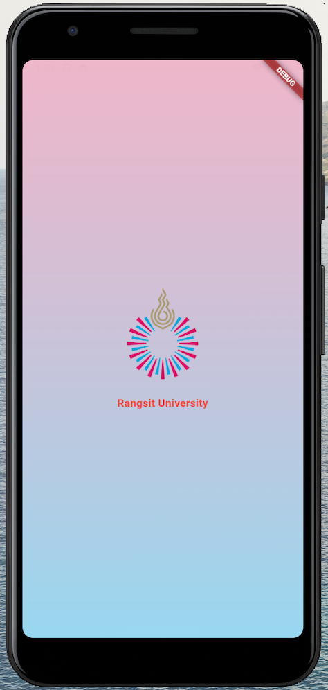
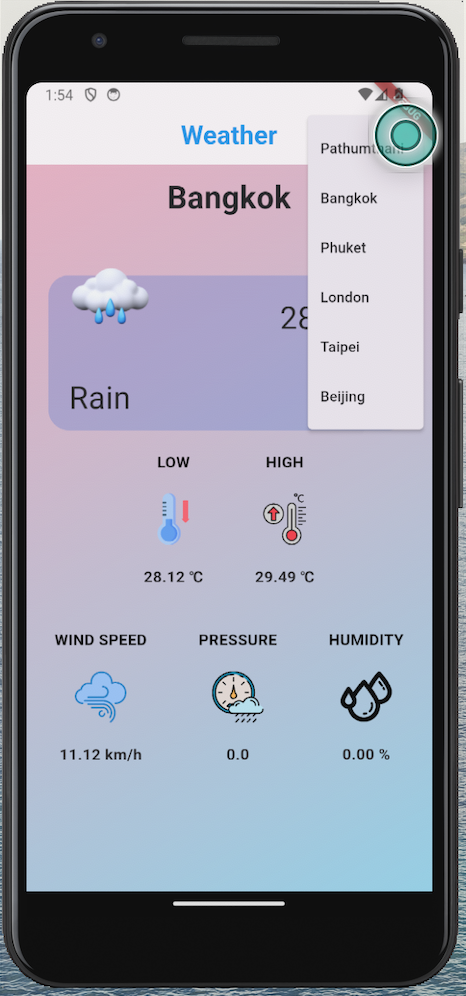
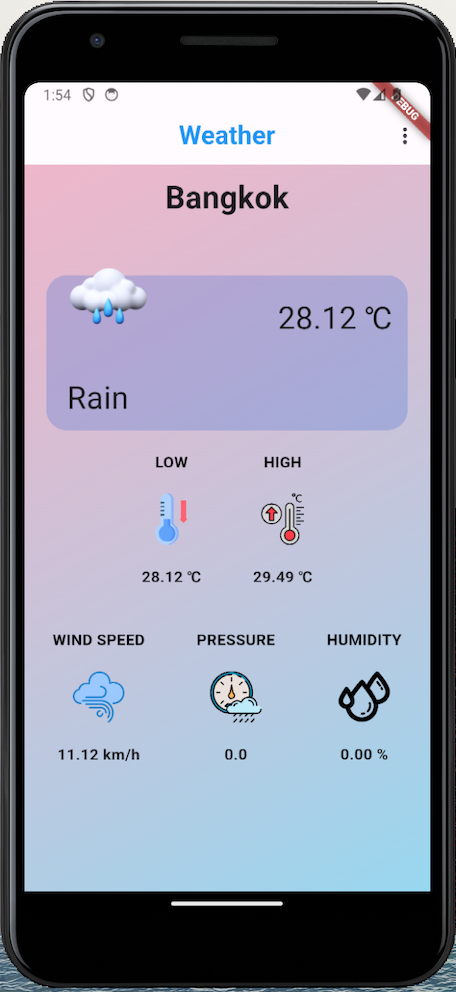
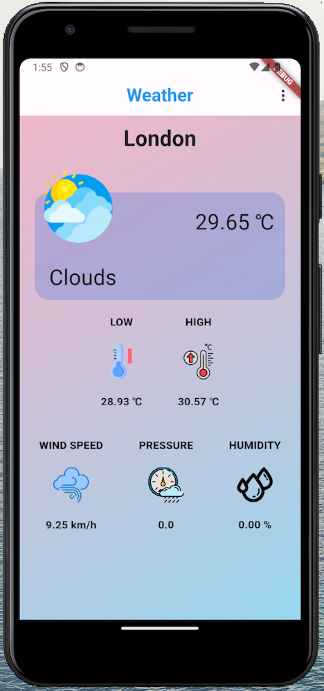

# Weather App - Flutter

This is final project of "Mobile Application Development" class by Rangsit University. It is a simple, beautiful weather application built with Flutter that displays current weather information for selected cities using the OpenWeatherMap API.

## Features

- Splash screen with immersive UI
- Select cities (Phuket, Bangkok, Pathumthani, London, Taipei, Beijing)
- Real-time temperature, high/low, pressure, wind speed, humidity
- Dynamic weather icons based on conditions
- Custom UI styling with gradients and responsive layout

## Screenshots

